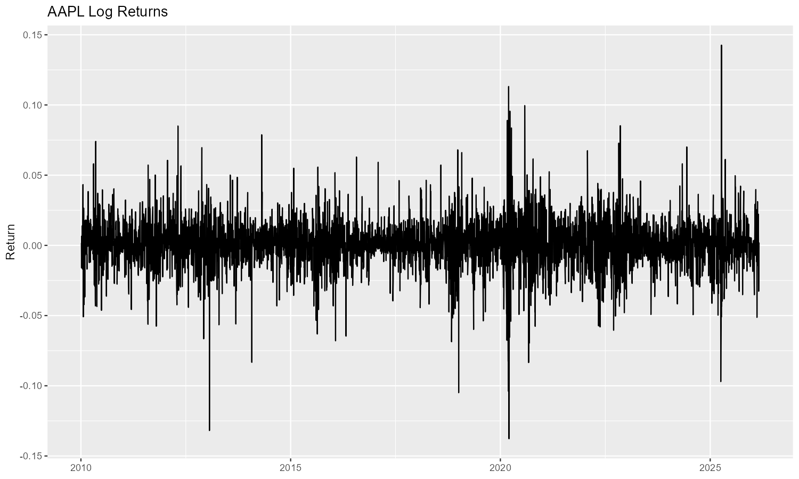
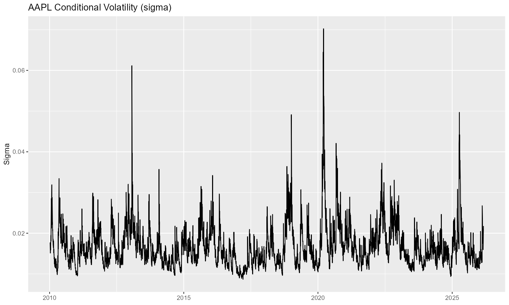

# ARIMA–GARCH Volatility Modelling of Equity Returns

## (Project Objective)

This project analyses the volatility dynamics of equity returns using ARIMA–GARCH models implemented in R. Financial return series are well known to exhibit characteristics such as volatility clustering, persistence, and large spikes during periods of market stress. The objective of this project is to estimate conditional volatility for stock returns and examine how volatility evolves over time.

Daily price data for Apple (AAPL) and Caterpillar (CAT) are obtained from Yahoo Finance. Logarithmic returns are calculated from adjusted closing prices to ensure stationarity and to capture percentage changes in asset prices.

## (Data and Pre-processing)

Daily adjusted closing prices are downloaded using the `quantmod` package in R. Log returns are computed using the standard transformation:

r_t = log(P_t) − log(P_{t−1})

where (P_t) represents the adjusted closing price at time (t).

Log returns are used instead of raw prices because financial returns are typically stationary, while price levels often follow non-stationary processes.

## (Model Specification)

To capture both the mean dynamics and time-varying volatility of the return series, an ARIMA–GARCH modelling framework is used.

For Apple (AAPL), the following specification is estimated:

Mean equation: ARMA(4,3)
Variance equation: eGARCH(4,3)

The eGARCH model is chosen because it models the logarithm of the conditional variance, allowing the model to capture asymmetric responses to positive and negative shocks without imposing non-negativity constraints.

For Caterpillar (CAT), a simpler specification is estimated:

Mean equation: ARMA(0,0)
Variance equation: sGARCH(1,1)

The GARCH framework captures the persistence of volatility by modelling the conditional variance as a function of past squared shocks and past variance.

Model estimation is performed using the `rugarch` package with maximum likelihood estimation.

## (Model Results and Interpretation)
## Apple (AAPL): eGARCH(4,3) with ARMA(4,3)

To capture both mean dynamics and time-varying volatility in Apple stock returns, an ARMA(4,3)–eGARCH(4,3) specification was estimated.

The ARMA component models serial dependence in the mean return process, while the eGARCH specification captures conditional heteroskedasticity and allows volatility to respond asymmetrically to market shocks.

The model parameters were estimated using maximum likelihood estimation with the rugarch package in R.

Diagnostic tests were performed on the standardized residuals to evaluate model adequacy.

## Diagnostic Tests

Several tests were applied to assess the quality of the model fit:

• Information Criteria (AIC/BIC) were used to evaluate model fit and compare specifications.
• Ljung–Box tests on standardized residuals check whether any serial correlation remains in the residuals.
• Ljung–Box tests on squared residuals test whether additional ARCH effects remain after fitting the model.
• Nyblom stability tests examine whether model parameters remain stable over the sample period.
• Probability Integral Transform (PIT) with Kolmogorov–Smirnov test assesses whether the assumed error distribution adequately fits the data.

The diagnostic results suggest that the model captures most of the serial dependence and volatility structure present in the return series.

## Volatility Behaviour

The estimated conditional volatility series shows clear volatility clustering, a well-known feature of financial return data. Periods of relatively calm market conditions are followed by bursts of high volatility.

The largest volatility spike occurs around 2020, corresponding to the COVID-19 market disruption. Following this shock, volatility gradually declines toward its long-run level, demonstrating the persistence of volatility captured by the GARCH framework.

These results indicate that the eGARCH model effectively captures the time-varying risk dynamics present in Apple stock returns.

## Caterpillar (CAT): sGARCH(1,1)

For Caterpillar stock, a simpler sGARCH(1,1) specification with no ARMA terms in the mean equation was estimated.

The mean equation assumes that returns follow a white-noise process, while the conditional variance is modelled using a standard GARCH structure.

The GARCH(1,1) specification captures volatility persistence through:

• ARCH term (α) — the impact of recent shocks on volatility
• GARCH term (β) — the persistence of past volatility

Diagnostic tests indicate that the model captures the primary volatility dynamics of the CAT return series, with volatility clustering visible during periods of market stress.

## (Results)
### AAPL Log Returns

The return series fluctuates around zero, which is typical for financial return data. Most daily movements are relatively small, but occasional large spikes occur during periods of market stress. These spikes represent large price movements in the stock.

The clustering of large movements indicates volatility clustering, where large shocks tend to occur close together in time.

### AAPL Conditional Volatility

The conditional volatility estimated from the eGARCH model shows clear periods of heightened market uncertainty. Volatility spikes correspond to periods where financial markets experienced increased turbulence.

The largest spike appears around 2020, coinciding with the COVID-19 market disruption. After such shocks, volatility gradually declines back toward its long-run level, demonstrating the persistence of volatility captured by the GARCH model.

The log return plot illustrates the irregular nature of financial returns. Most observations fluctuate near zero, but occasional large shocks appear throughout the sample.

The conditional volatility plot generated from the eGARCH model clearly illustrates volatility clustering. Several spikes are visible across the sample period, with the largest spike occurring around 2020 during the COVID-19 financial market disruption.

These spikes reflect periods where uncertainty in financial markets increased significantly, causing large fluctuations in asset prices. The gradual decline following these spikes indicates the persistence of volatility, a key property that GARCH models are designed to capture.

## (Model Diagnositc and Goodnedss of Fit)
To evaluate whether the estimated ARMA–GARCH models adequately capture the statistical properties of the return series, several diagnostic tests were performed on the standardized residuals.

#### Information Criteria

Model fit was first evaluated using several information criteria, including the Akaike Information Criterion (AIC), Bayesian Information Criterion (BIC), Shibata criterion, and the Hannan–Quinn criterion.

The estimated values were:

* **AIC:** −5.2484
* **BIC:** −5.2438
* **Shibata:** −5.2484
* **Hannan–Quinn:** −5.2468

Lower values of these criteria indicate a better balance between model fit and model complexity. These results suggest that the selected specification provides a good fit to the data relative to alternative model structures.

#### Ljung–Box Test on Standardized Residuals

To determine whether any serial correlation remained in the residuals after model estimation, the Ljung–Box test was applied to the standardized residuals.

The test statistic was:

* **X² = 15.627**
* **p-value = 0.1108**

Since the p-value is greater than the conventional 5% significance level, the null hypothesis of no autocorrelation cannot be rejected. This indicates that the residuals behave approximately like white noise and that the model successfully captures the serial dependence present in the return series.

#### Ljung–Box Test on Squared Residuals

A second Ljung–Box test was applied to the squared standardized residuals to check for any remaining ARCH effects.

The results were:

* **X² = 6.5115**
* **p-value = 0.7706**

Because the p-value is substantially greater than 0.05, there is no evidence of remaining autocorrelation in the squared residuals. This suggests that the GARCH specification successfully captures the volatility clustering present in the financial return series.

#### Parameter Stability (Nyblom Test)

Parameter stability was assessed using the Nyblom stability test. This test evaluates whether the estimated parameters remain stable over the sample period.

The individual Nyblom statistics were:

* **ω = 3.795**
* **α₁ = 0.293**
* **β₁ = 0.601**

The critical values for the test are:

* **10%:** 0.353
* **5%:** 0.470
* **1%:** 0.748

The ARCH and GARCH parameters remain below the 1% critical value, suggesting reasonable parameter stability over time. However, the constant variance parameter appears larger than the critical values, which may reflect structural shifts in volatility over the long sample period.

#### Distributional Adequacy (PIT and KS Test)

The adequacy of the assumed error distribution was evaluated using the Probability Integral Transform (PIT) together with a Kolmogorov–Smirnov (KS) test.

The KS test statistic was:

**D = 0.9989**
**p-value < 2.2 × 10⁻¹⁶**

This result strongly rejects the null hypothesis that the transformed residuals follow a uniform distribution. This suggests that the assumed normal distribution may not fully capture the heavy tails typically observed in financial return data. In practice, this indicates that alternative error distributions such as the Student-t distribution may provide a better fit.

## Overall Diagnostic Assessment

Overall, the diagnostic tests suggest that the model successfully captures the key time-series properties of the return data. The Ljung–Box tests indicate that serial correlation and volatility clustering have been effectively modelled. However, the distributional test suggests that the assumption of normally distributed errors may be restrictive, which is consistent with the heavy-tailed nature of financial returns.

### (Volatility Persistence)

For the CAT model, volatility persistence is measured by the sum of the ARCH and GARCH parameters:

α + β

From the estimated sGARCH(1,1) model, the ARCH parameter is:

alpha1 = 5.887043e-02  ≈ 0.0589

and the GARCH parameter is:

beta1  = 9.116067e-01  ≈ 0.9116

This gives a persistence value of:

α + β ≈ 0.9705

The ARCH coefficient indicates that approximately 5.9% of today's volatility is explained by yesterday's shock, while the GARCH coefficient shows that around 91.2% of today's volatility depends on the previous period's volatility level. This suggests that volatility dynamics in the CAT return series are largely driven by persistence rather than short-term shocks.

Because this value is less than one, the variance process is stationary, meaning that volatility shocks eventually decay over time. However, the persistence value being close to one indicates that volatility shocks are highly persistent. In practice, this means that periods of high volatility tend to last for several periods before gradually reverting toward the long-run average level of volatility. 

### (Limitations and Potential Improvements)

While the estimated ARIMA–GARCH framework captures the key dynamics of the return series, several limitations remain. The diagnostic tests indicate that although the model successfully removes serial correlation and captures volatility clustering, the Kolmogorov–Smirnov test rejects the assumption of normally distributed errors. This suggests that the normal distribution may not adequately capture the heavy tails typically observed in financial return data.

One potential improvement would be to estimate the model using alternative error distributions, such as the Student-t or generalized error distribution, which are commonly used in financial econometrics to better account for extreme market movements.

Additionally, future extensions of the model could include asymmetric volatility specifications or alternative volatility models to further explore the impact of market shocks on conditional variance. Comparing multiple model specifications using information criteria could also provide further insight into the most appropriate volatility structure for the data.

Despite these limitations, the current model successfully captures the main stylized facts of financial return series, including volatility clustering and persistent conditional variance dynamics.

## (Key Findings)

The empirical results highlight several stylised facts of financial return series:

• Stock returns fluctuate around zero with little serial correlation in the mean
• Volatility is time-varying rather than constant
• Large shocks lead to temporary increases in market volatility
• Volatility decays gradually after major shocks

The ARMA–GARCH framework successfully captures these dynamics, making it a useful tool for modelling financial market risk.

## (Conclusion)

Overall, the ARIMA–GARCH framework provides an effective approach for modelling financial return volatility. The models capture volatility clustering and the persistence of shocks, demonstrating how conditional variance evolves through time. Such models are widely used in financial econometrics for risk management, forecasting volatility, and understanding market behaviour.
